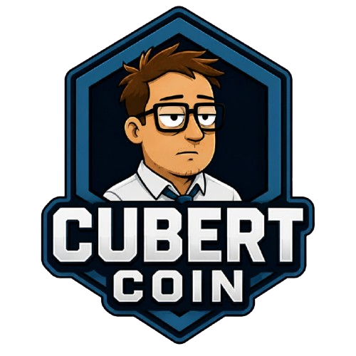

 
   

<h3 align="center">Proof of Burnout.</h3>

 
  <em>The first cryptocurrency built for Corporate Survivors.</em> 

  
  
  
  
  

---

Cubert created this coin during a meeting that should have been an email.
Nobody noticed.

Millions of professionals survive meetings, spreadsheets, KPIs, deadlines, performance reviews and corporate jargon every day.

Cubert is one of them.

---

## 📋 Project Status

| Item | Status |
|---|---|
| 🌐 Website | ✅ Live at [cubertcoin.com](https://cubertcoin.com) |
| 👥 Community | 🟡 Phase 1 — Building |
| 💎 Token | ⚪ Pre-Launch |
| 📄 Smart Contract | ⚪ Pending |
| 🔒 Liquidity Lock | ⚪ Pending |

## 🏢 Corporate Ladder

| Level | Position | Status |
|---|---|---|
| L1 | Intern | ✅ Complete |
| L2 | Analyst | 🟡 In Progress |
| L3 | Senior Analyst | ⚪ Pending |
| L4 | Manager | ⚪ Pending |
| L5 | Director | ⚪ Pending |
| L6 | Executive | ⚪ Pending |

## 🎯 Mission

Build the largest community of Corporate Survivors on the internet.

> *Turn burnout into belonging.*

## 📁 Core Documents

- 📘 [Brand Book](./brand-book)
- 👔 [Employee Handbook](./employee-handbook)
- 🎨 [Media Kit](./media-kit)
- 🗺️ [Roadmap](./roadmap)
- 📊 [Tokenomics](./tokenomics)

## 🌐 Official Channels

| Platform | Link |
|---|---|
| 🌐 Website | [Corporate Intranet](https://www.cubertcoin.com) |
| 🐦 X / Twitter | [Corporate Broadcast System](https://x.com/cubertcoin) |
| 💬 Discord | [Corporate Survivors HQ](https://discord.gg/UqJwHACWhz) |
| 📢 Telegram | [Corporate Hotline](https://t.me/cubertcoin) |
| 👽 Reddit | [Employee Forum](https://reddit.com/r/CubertCoin) |
| 📸 Instagram | [Corporate Gallery](https://www.instagram.com/cubertcoin) |
| 💻 GitHub | [Corporate Repository](https://github.com/CubertCoin/cubertcoin) |

## 🤝 Contributing

Want to contribute memes, content, or feedback?
Read our [Contributing Guide](CONTRIBUTING.md) to get started.

- 🐛 [Report a bug](https://github.com/CubertCoin/cubertcoin/issues/3)
- 🎨 [Submit content](https://github.com/CubertCoin/cubertcoin/issues/1)
- 💬 [Join discussions](https://github.com/CubertCoin/cubertcoin/discussions)

## ⚠️ Corporate Notice

Cubert Coin is a community-driven project built around corporate culture, workplace humor, and the shared experience of surviving modern office life.

No promises. No guarantees. Just Proof of Burnout.

---

**Proof of Burnout.**

*Another Meeting. Another Token.*
